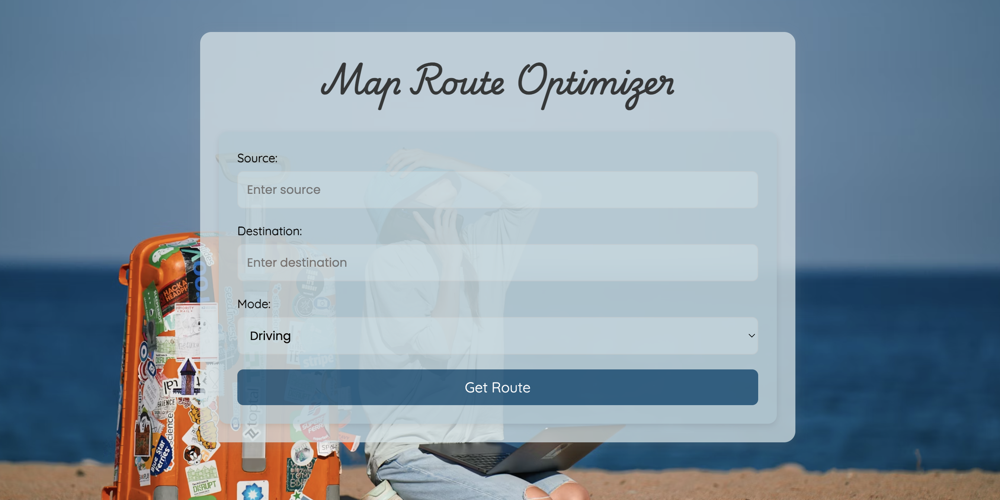
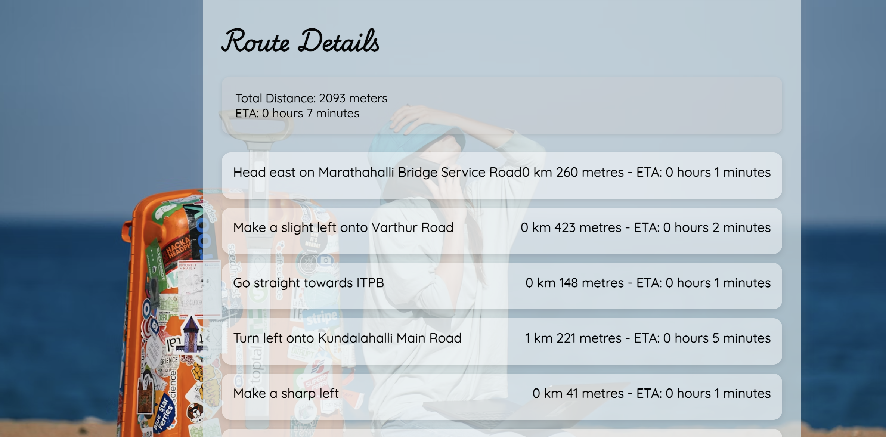

# 🚀 Navido Frontend        https://navido.tech

## 🌍 Overview
Navido is a **map route optimizer** designed to provide users with the most efficient travel routes based on **real-time traffic data**. The frontend is built using **React** and styled with **CSS**, offering a seamless experience for users to input their locations and receive **optimized navigation suggestions**.


---

## ✨ Features
- 🌟 **User-friendly interface** for entering **source** and **destination**
- 🏎️ **Supports multiple travel modes** (**Driving, Walking, Bicycling**)
- 📍 **Real-time optimized route fetching** with estimated **time & distance**
- 🗺️ **Step-by-step navigation guidance**
- 🎨 **Smooth UI animations** powered by **Lottie**
- 📱 **Responsive design** for both **desktop & mobile** users

---

## 🛠️ Tech Stack
- **Frontend:** React, CSS
- **State Management:** React Hooks
- **Backend API:** Java Spring Boot (Hosted on Azure)
- **Libraries:** Axios (for API calls), Lottie React (for animations)

---

## 📥 Installation Guide

### ✅ Prerequisites
Ensure you have the following installed:
- **Node.js** (v14+ recommended)
- **npm** or **yarn**

### 🔧 Setup Steps
1. Clone the repository:
   ```bash
   git clone https://github.com/kaushalmarandi/navido-frontend.git
   cd navido-frontend
   ```
2. Install dependencies:
   ```bash
   npm install
   ```
3. Start the development server:
   ```bash
   npm run dev
   ```
4. Open the application in your browser:
   ```
   http://localhost:3000
   ```

---

## 🔗 API Integration
The frontend communicates with the **Navido Backend API**, hosted on **Azure**, which processes route requests and delivers optimized travel details.

### 📡 Fetching Optimized Routes
The frontend sends a **POST** request to retrieve route details.

### Access Backend source code on
- https://github.com/kaushalmarandi/MapRoute


#### 🌐 API Endpoint
```http
POST https://routeme.azurewebsites.net/maps/route
```

#### 📩 Request Body Example
```json
{
  "source": "New York, NY",
  "destination": "Los Angeles, CA",
  "mode": "driving"
}
```

#### 📤 Response Example



```json
{
  "totalDistance": "4500 km",
  "eta": "40 hours",
  "steps": [
    {
      "instructions": "Start from New York",
      "readable_distance": "2 km",
      "readable_duration": "5 min"
    }
  ]
}
```

---

## 🚀 Deployment Guide
To deploy this project:
1. Build the project:
   ```bash
   npm run build
   ```
2. Deploy using **Vercel, Netlify, or GitHub Pages**.
3. Ensure the backend API is running and accessible.

---


# React + Vite

This template provides a minimal setup to get React working in Vite with HMR and some ESLint rules.

Currently, two official plugins are available:

- [@vitejs/plugin-react](https://github.com/vitejs/vite-plugin-react/blob/main/packages/plugin-react/README.md) uses [Babel](https://babeljs.io/) for Fast Refresh
- [@vitejs/plugin-react-swc](https://github.com/vitejs/vite-plugin-react-swc) uses [SWC](https://swc.rs/) for Fast Refresh


